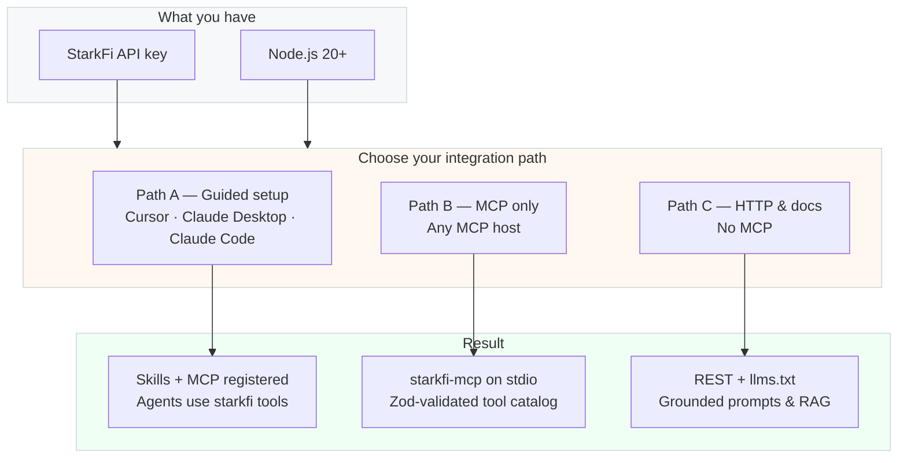

<div align="center">

# StarkFi for AI-native integration

**Official paths to connect payments, yield, orders, and KYC to assistants and agents—without reverse-engineering the API.**

<br>

[](https://www.npmjs.com/package/starkfi-mcp)
[](https://www.npmjs.com/package/starkfi-agent-skills)
[](https://starkfi.mintlify.app/)
[](https://modelcontextprotocol.io/)
[](https://nodejs.org/)

<br>

[Documentation](https://starkfi.mintlify.app/) · [Getting started & KYC](https://starkfi.mintlify.app/getting-started) · [LLM index](https://starkfi.mintlify.app/llms.txt) · [Dashboard](https://starkfi.io/)

</div>

<br>

---

## Overview

StarkFi exposes a production **HTTP API** at `https://api.starkfi.io` for **StarkPay**, **yield**, **orders**, and **KYC**. For teams building with **Cursor**, **Claude Desktop**, **Claude Code**, or any **MCP-compatible** client, we publish a typed **Model Context Protocol** surface and **agent skills** so models call **validated tools** instead of improvising requests.

This page is the **entry map**: choose a path, copy the minimum configuration, and link out to the repositories for depth.



---

## Table of contents

| Section | Description |
|---------|-------------|
| [Prerequisites](#prerequisites) | API key, runtime, compliance |
| [Path A — One-command setup](#path-a--one-command-setup-recommended) | Fastest for Cursor & Claude |
| [Path B — MCP server](#path-b--mcp-server-any-host) | Bring your own MCP client |
| [Path C — Documentation](#path-c--documentation--llm-index) | Direct HTTP and `llms.txt` |
| [Tool catalog](#mcp-tool-catalog) | Domain prefixes at a glance |
| [Agent skills](#cursor-agent-skills) | Cursor `SKILL.md` bundles |
| [Security](#security--compliance) | Secrets and configuration hygiene |
| [Repositories](#official-repositories) | Source and issue trackers |

---

## Prerequisites

| Requirement | Specification |
|-------------|---------------|
| **API credential** | `STARKFI_API_KEY` — HTTP header `x-api-key` on all API calls. Issue and rotate keys in the [StarkFi dashboard](https://starkfi.io/). |
| **Runtime** | **Node.js 20 or newer** for `starkfi-mcp` and setup tooling. |
| **Product readiness** | Account, environment, and **KYC** steps per [Getting started](https://starkfi.mintlify.app/getting-started) before exercising live flows. |

---

## Path A — One-command setup (recommended)

**Best for:** teams on **Cursor** and **Claude Desktop** who want **agent skills** and **MCP** wired consistently on developer machines.

The [`starkfi-agent-skills`](https://github.com/starkfi-io/starkfi-agent-skills) package copies official **Cursor Agent Skills** and merges the **StarkFi** MCP server into host configuration (see repository README for Claude Code flags).

| Step | Action |
|:----:|--------|
| 1 | Export your API key: `export STARKFI_API_KEY="your_key_here"` |
| 2 | Run: `npx starkfi-agent-skills setup` |
| 3 | **Fully restart** Cursor and Claude Desktop so MCP definitions reload |

**CI and automation:**

```bash
STARKFI_API_KEY="your_key_here" npx starkfi-agent-skills setup --yes
```

**What gets configured**

| Host | Outcome |
|------|---------|
| **Cursor** | Skills under `~/.cursor/skills/` · `mcpServers.starkfi` in `~/.cursor/mcp.json` invoking `npx -y starkfi-mcp` |
| **Claude Desktop** (macOS) | `~/Library/Application Support/Claude/claude_desktop_config.json` updated with the same MCP entry |
| **Claude Code** | Optional project `.mcp.json` — use `--claude-code-project` or the CLI flow documented in the repo |

**References:** [GitHub — starkfi-agent-skills](https://github.com/starkfi-io/starkfi-agent-skills) · [npm — starkfi-agent-skills](https://www.npmjs.com/package/starkfi-agent-skills)

---

## Path B — MCP server (any host)

**Best for:** **custom agents**, **IDEs**, or **platforms** that already speak MCP over **stdio** and only need the StarkFi tool surface.

[`starkfi-mcp`](https://www.npmjs.com/package/starkfi-mcp) is the published package from [**starkfi-mcp-agent**](https://github.com/starkfi-io/starkfi-mcp-agent): TypeScript, ESM, **Zod**-validated tools, default base URL `https://api.starkfi.io` (override with `STARKFI_BASE_URL`).

| Step | Command |
|:----:|---------|
| Run | `STARKFI_API_KEY="your_key_here" npx -y starkfi-mcp` |
| Pin version | `STARKFI_API_KEY="your_key_here" npx -y starkfi-mcp@x.y.z` |

<details>
<summary><strong>Environment variables</strong></summary>

| Variable | Required | Purpose |
|:--------:|:--------:|---------|
| `STARKFI_API_KEY` | Yes | Sent as `x-api-key` on every StarkFi request |
| `STARKFI_BASE_URL` | No | API base URL; default `https://api.starkfi.io` |

The server may load a local `.env` when the process environment is unset; values already set by the MCP host are not overwritten.

</details>

<details>
<summary><strong>Example MCP host configuration</strong> (Cursor / Claude Desktop)</summary>

```json
{
  "mcpServers": {
    "starkfi": {
      "command": "npx",
      "args": ["-y", "starkfi-mcp"],
      "env": {
        "STARKFI_API_KEY": "your_key_here"
      }
    }
  }
}
```

For a global binary on `PATH`, set `"command": "starkfi-mcp"` and omit `args`, or point `command` / `args` at a built `dist/index.js` from a clone—see the [starkfi-mcp-agent README](https://github.com/starkfi-io/starkfi-mcp-agent/blob/main/README.md).

</details>

**References:** [GitHub — starkfi-mcp-agent](https://github.com/starkfi-io/starkfi-mcp-agent) · [npm — starkfi-mcp](https://www.npmjs.com/package/starkfi-mcp)

---

## Path C — Documentation & LLM index

**Best for:** **plain HTTP** clients, **custom LLM** stacks, or **RAG** where MCP is not in scope.

| Resource | URL |
|----------|-----|
| **Product & API documentation** | [starkfi.mintlify.app](https://starkfi.mintlify.app/) |
| **Structured index for models** | [starkfi.mintlify.app/llms.txt](https://starkfi.mintlify.app/llms.txt) |

Use `llms.txt` to ground assistants on endpoints and flows without exposing credentials in prompts.

---

## MCP tool catalog

Tools are grouped by **prefix**; each tool’s MCP description guides **when** the model should invoke it.

| Prefix | Coverage |
|--------|----------|
| `yield_*` | Strategies, rebalance, earnings, deposit / withdraw / rebalance builds, broadcast |
| `order_*` | Order templates: list, retrieve, create, partial update, active toggle |
| `starkpay_*` | Payment status, intents, transaction creation, on-chain broadcast, card tokenization payloads |
| `kyc_*` | Prepare user, email OTP, verify OTP, Didit session, status |

API requests use **root-relative** paths on the configured host (for example `GET /yield/strategies`, `GET /kyc/status`)—see the [starkfi-mcp-agent](https://github.com/starkfi-io/starkfi-mcp-agent) repository for the authoritative tool list.

---

## Cursor agent skills

Official **`SKILL.md`** bundles teach the agent **yield**, **StarkPay / orders**, **KYC**, and **MCP host** conventions. They ship with **starkfi-agent-skills** and are indexed under `agent-skills/` in both repositories. Install into **`.cursor/skills/`** (or rely on `starkfi-agent-skills setup`) so Cursor discovers them automatically.

| Skill focus | Typical use |
|-------------|-------------|
| MCP overview | Host config, env vars, tool prefixes, secret handling |
| Yield | Deposit, withdraw, rebalance, broadcast workflows |
| Payments | Orders and StarkPay lifecycle |
| KYC | Ordered verification and Didit-related steps |

---

## Security & compliance

> **Treat `STARKFI_API_KEY` as a production secret.** Store it in the MCP host `env` block, a secure environment, or a secret manager—not in source control.

- Do not commit keys, `.env` files with live credentials, or host configs that embed literals in shared repos.
- If you use `${STARKFI_API_KEY}` in `.mcp.json`, document how engineers export the variable and keep private paths out of version control.
- Rotate keys from the dashboard if a credential may have leaked.

---

## Official repositories

| Repository | Responsibility |
|------------|------------------|
| [**starkfi-agent-skills**](https://github.com/starkfi-io/starkfi-agent-skills) | One-shot developer setup: Cursor skills + MCP registration for Cursor, Claude Desktop, and Claude Code options |
| [**starkfi-mcp-agent**](https://github.com/starkfi-io/starkfi-mcp-agent) | `starkfi-mcp` implementation, tool schemas, build scripts, and advanced MCP host documentation |

---

## Quick reference

| Goal | Command or link |
|------|-----------------|
| Fastest Cursor / Claude onboarding | `npx starkfi-agent-skills setup` then restart the application |
| Run MCP server standalone | `STARKFI_API_KEY=… npx -y starkfi-mcp` |
| Read-only grounding for LLMs | [llms.txt](https://starkfi.mintlify.app/llms.txt) |
| Protocol specification | [Model Context Protocol](https://modelcontextprotocol.io/) |

---

<div align="center">

**StarkFi** · [Website & dashboard](https://starkfi.io/) · [Documentation](https://starkfi.mintlify.app/)

*Integration assets are provided as-is; refer to repository licenses and terms of service for your environment.*

</div>
